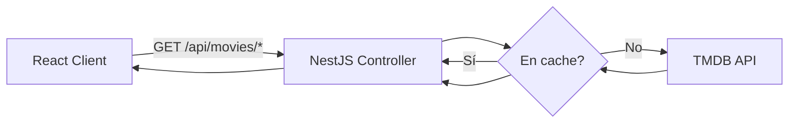

# Fase 3: Backend — TMDB, Movies, Cache Modules

## Contexto
[plan.md](./plan.md) | Depende de: Fase 2

## Overview
- Prioridad: Alta
- Estado: Pending
- Implementar módulos NestJS: `TmdbModule` (cliente HTTP hacia TMDB), `MoviesModule` (endpoints propios), `CacheModule` (in-memory)

## Key Insights
- TMDB API key **nunca** en el frontend — todas las llamadas pasan por nuestro backend
- Cache in-memory (`@nestjs/cache-manager` con store default) es aceptable para demo; se pierde en cada restart de Passenger — documentado como deuda técnica, NO resolver ahora
- MySQL en esta fase MVP no es estrictamente necesario (no hay auth/watchlist) — evaluar si se necesita DB en fase 1 o se difiere. Marcado como pregunta abierta.

## Requirements

### Funcionales
- `GET /api/movies/trending` → proxy cacheado a TMDB trending
- `GET /api/movies/search?q=` → proxy cacheado a TMDB search
- `GET /api/movies/:id` → proxy cacheado a TMDB movie detail (incluye cast, trailers)
- Cache TTL: 1 hora para trending/detail, 10 min para search (datos cambian menos)

### No Funcionales
- Rate limiting hacia TMDB respetado (usar cache agresivamente para no exceder límites)
- Rate limiting de ENTRADA (cliente → nuestra API): `@nestjs/throttler`, ~20 req/min por IP en los 3 endpoints — previene que un loop de frontend o abuso agote la cuota de TMDB para todos los usuarios (hallazgo de `/ck:predict`)
- Cache in-memory con `max` de items definido (ej. 100) para evitar crecimiento sin límite (hallazgo de `/ck:predict`)
- Manejo de errores: si TMDB falla, devolver 502 con mensaje claro, no crashear la app
- Variables de entorno: `TMDB_API_KEY`, `TMDB_BASE_URL` vía `@nestjs/config`

## Architecture

## Related Code Files
**Crear en `apps/api/src/`:**
- `tmdb/tmdb.module.ts`
- `tmdb/tmdb.service.ts` (HttpModule, wraps fetch a TMDB)
- `movies/movies.module.ts`
- `movies/movies.controller.ts`
- `movies/movies.service.ts` (usa TmdbService + CacheService)
- `config/configuration.ts` (env vars typed)
- `.env.example` (actualizar con TMDB_API_KEY, TMDB_BASE_URL)

## Implementation Steps
1. Instalar deps en `apps/api`: `@nestjs/axios`, `@nestjs/cache-manager`, `cache-manager`, `@nestjs/config`, `@nestjs/throttler`
2. Crear `ConfigModule.forRoot()` en `app.module.ts`, cargar `.env`
3. Crear `TmdbModule` con `TmdbService`: método `getTrending()`, `search(query)`, `getMovieDetail(id)` — usa `HttpService` de `@nestjs/axios`, header `Authorization: Bearer ${TMDB_API_KEY}`
4. Crear `CacheModule` global (`CacheModule.register({ isGlobal: true, ttl: ... })`)
5. Crear `MoviesModule` con `MoviesController` (3 endpoints) y `MoviesService` que usa `@Inject(CACHE_MANAGER)` para wrap-cachear las llamadas a `TmdbService`
6. Manejo de errores: interceptor o try/catch que traduce errores de axios a `HttpException(502, ...)`
7. Escribir `.env.example` con placeholders (sin key real)
8. Probar manualmente los 3 endpoints con curl/Postman

## Todo List
- [ ] `TmdbService` implementado y probado contra API real de TMDB
- [ ] `MoviesController` expone los 3 endpoints
- [ ] Cache funcionando (segunda llamada al mismo endpoint no golpea TMDB — verificar con logs)
- [ ] Manejo de error 502 cuando TMDB falla o key inválida
- [ ] `.env.example` actualizado

## Success Criteria
- Los 3 endpoints devuelven JSON válido consumiendo datos reales de TMDB
- Response time de segunda llamada (cacheada) es sensiblemente menor que la primera

## Risk Assessment
- Riesgo: límites de rate de TMDB (free tier ~40 req/10s) — mitigado por cache agresivo
- Riesgo: sin DB, no hay persistencia de nada más allá de cache en memoria — aceptado para MVP, documentar límite

## Security Considerations
- `TMDB_API_KEY` solo en `.env` del servidor, nunca en respuesta JSON al cliente, nunca en logs
- CORS: configurar `apps/api` para aceptar solo origen del frontend en producción

## Unresolved Questions
- ¿MySQL se necesita ya en MVP o se difiere completamente a Fase 2 (auth/watchlist)? Recomendación: diferir, así Fase 6 (deploy) es más simple (sin configurar DB en hPanel todavía)

## Next Steps
→ Fase 5: integrar con frontend (Fase 4) sirviendo ambos desde un solo proceso
