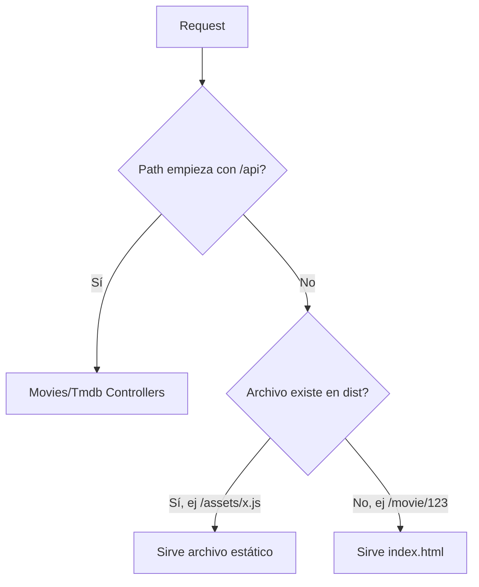

# Fase 5: Integración — Servir React desde NestJS

## Contexto
[plan.md](./plan.md) | Depende de: Fase 3, Fase 4

## Overview
- Prioridad: Alta
- Estado: Pending
- Un solo proceso Node (NestJS) sirve la API bajo `/api/*` Y el build estático de React para todo lo demás — requisito de Passenger (1 app Node en hPanel)

## Key Insights
- Passenger espera UN entry point Node — no dos procesos escuchando puertos distintos en producción
- `ServeStaticModule` de NestJS sirve el `dist` de Vite; las rutas de React Router (`/movie/123`) deben caer siempre en `index.html` (fallback) — esto es EXACTAMENTE lo que las rewrite rules de `.htaccess` resuelven, pero como NestJS ya maneja el fallback via `ServeStaticModule`, el `.htaccess` es una capa adicional de seguridad si Apache está delante de Passenger

## Requirements
- `GET /api/*` → NestJS controllers (Fase 3)
- `GET /*` (cualquier otra ruta) → sirve `apps/web/dist/index.html` (SPA fallback)
- `GET /assets/*` → sirve estáticos de `apps/web/dist/assets`

## Architecture


## Related Code Files
**Modificar en `apps/api`:**
- `src/app.module.ts` (agregar `ServeStaticModule`)
- `package.json` root (agregar script `build` que copia `apps/web/dist` a donde NestJS lo espera, o referenciar path directo)

**Crear:**
- `apps/web/public/.htaccess` (rewrite rules SPA, para Apache si aplica delante de Passenger)

## Implementation Steps
1. Instalar en `apps/api`: `@nestjs/serve-static`
2. En `app.module.ts`, importar `ServeStaticModule.forRoot({ rootPath: join(__dirname, '..', '..', 'web', 'dist'), exclude: ['/api/*'] })`
   - Ajustar el path relativo exacto según dónde quede `apps/web/dist` respecto a `apps/api/dist` tras el build (verificar con `__dirname` real en runtime, no asumir)
3. Verificar que `exclude: ['/api/*']` evita que ServeStaticModule intercepte rutas de API
4. **Fallback SPA determinístico (corrección de red-team — no confiar en comportamiento implícito de `serve-static`):** crear un controller explícito `AppController` con `@Get('*')` registrado DESPUÉS de `MoviesController` en el orden de módulos, que lee y devuelve el contenido de `index.html` (vía `res.sendFile()`) para cualquier ruta no capturada por rutas más específicas. Esto es comportamiento explícito y testeable, no depende de opciones internas de `serve-static` que varían entre versiones.
5. Crear `.htaccess` en `apps/web/public/` (se copia al `dist` en build) con reglas estándar de rewrite SPA:
   ```apache
   <IfModule mod_rewrite.c>
     RewriteEngine On
     RewriteBase /
     RewriteRule ^index\.html$ - [L]
     RewriteCond %{REQUEST_FILENAME} !-f
     RewriteCond %{REQUEST_FILENAME} !-d
     RewriteRule . /index.html [L]
   </IfModule>
   ```
6. Probar build completo local: `npm run build` desde raíz, luego `node apps/api/dist/main.js`, verificar que `/`, `/movie/123`, `/api/movies/trending` todos responden correctamente

## Todo List
- [ ] `ServeStaticModule` configurado, no interfiere con rutas `/api/*`
- [ ] Ruta profunda de React Router (`/movie/123`) refresca correctamente sin 404
- [ ] `.htaccess` versionado en `apps/web/public/`, se copia al build
- [ ] Build completo probado end-to-end en local simulando producción (no `npm run dev`)

## Success Criteria
- `curl http://localhost:3000/api/movies/trending` devuelve JSON
- `curl http://localhost:3000/movie/123` devuelve el HTML de la SPA (no 404, no JSON de error)
- Refrescar el navegador en `/movie/123` no rompe (prueba manual)

## Risk Assessment
- Riesgo MÁS ALTO del plan: rutas relativas rotas entre `apps/api/dist` y `apps/web/dist` al desplegar en servidor real con distinta estructura de carpetas que en local → mitigar con path absoluto vía variable de entorno `WEB_DIST_PATH` en vez de relativo hardcodeado, validar explícitamente en Fase 6

## Next Steps
→ Fase 6: deployment real en Hostinger, donde esta configuración se pone a prueba de verdad
